# NeonShop - Modern E-Commerce Platform

A fully-featured, responsive e-commerce application built with React, TypeScript, Redux Toolkit, and Tailwind CSS. This project demonstrates modern web development practices with a focus on user experience, performance, and maintainability.

## 🌟 Live Demo

**Project URL**: https://challange-front.vercel.app

## 📸 Screenshots

> **Note**: Add your screenshots to a `screenshots/` folder in the project root and reference them below.

### 🏠 Homepage

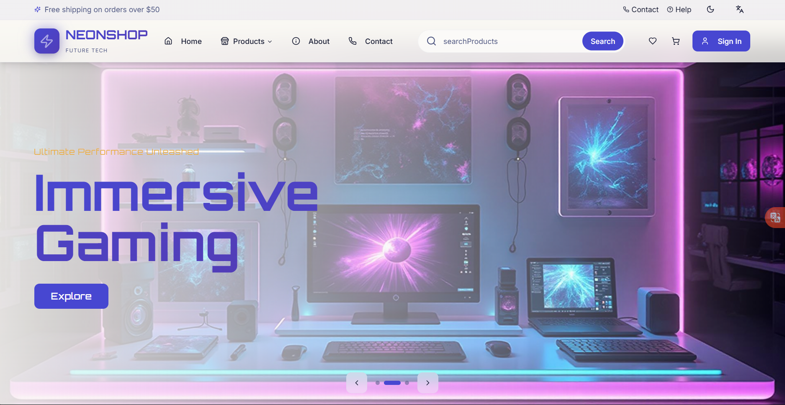
*Hero carousel with promotional banners and smooth transitions between slides*

---

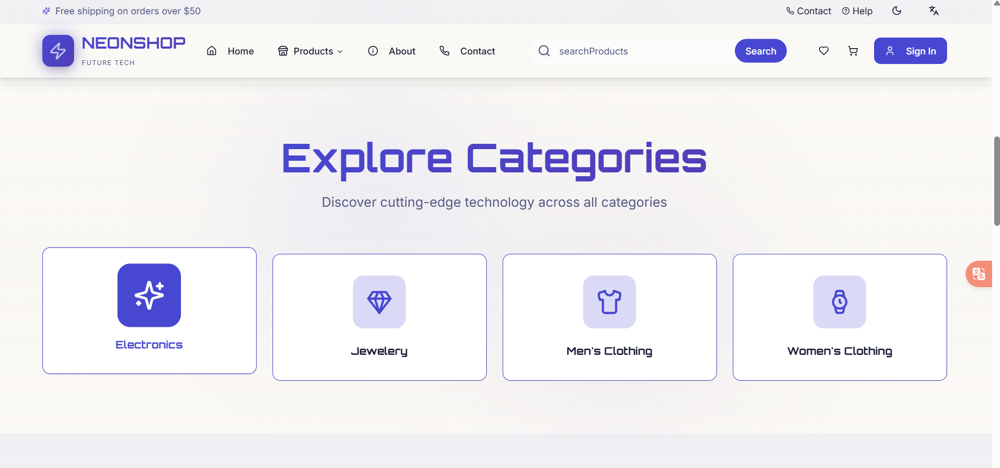
*Category cards with hover effects and navigation to filtered product lists*

---

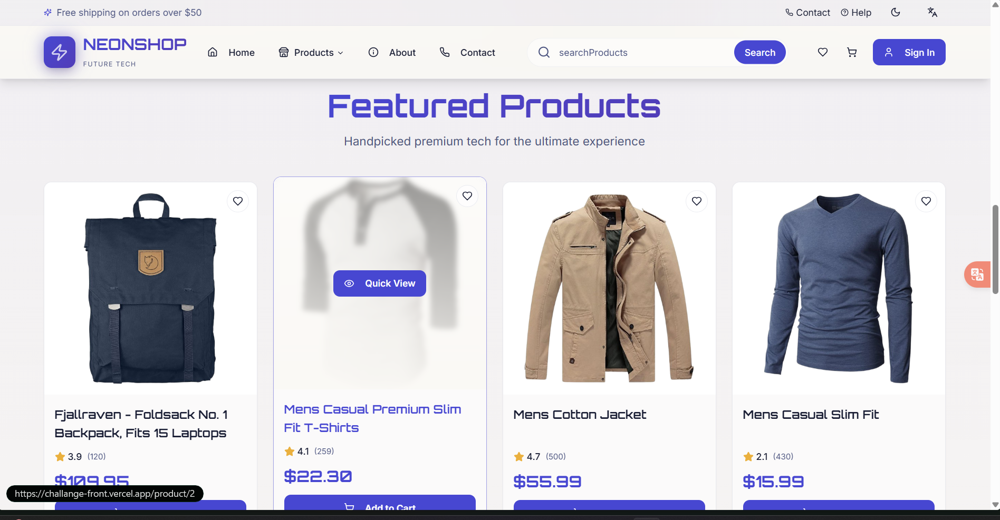
*Featured products section with product cards, quick view, and add to cart functionality*

---

### 🛍️ Product Catalog

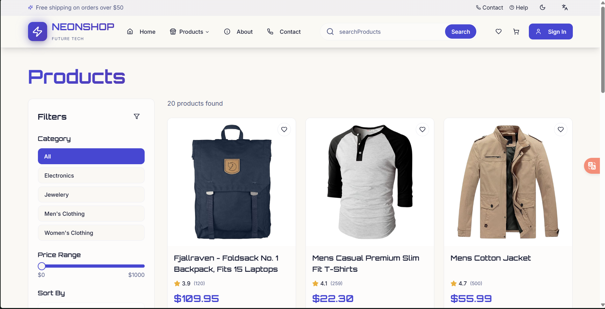

*Responsive product grid with cards showing product images, prices, ratings, and quick actions*

*Advanced filtering sidebar with category selection, price range slider, and sorting options*

*Real-time search functionality with instant results and product suggestions*

*Product pagination controls for navigating through multiple pages*

---

### 📦 Product Detail Page

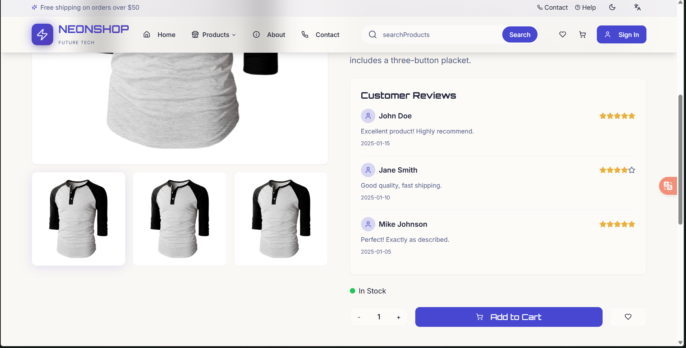

*Product detail page with image gallery, title, price, rating, description, and add to cart button*

*Multiple product images with thumbnail navigation and zoom functionality*

*Customer reviews and ratings with user comments, dates, and helpful votes*

*Quick view modal showing product details without leaving the current page*

---

### 🛒 Shopping Cart

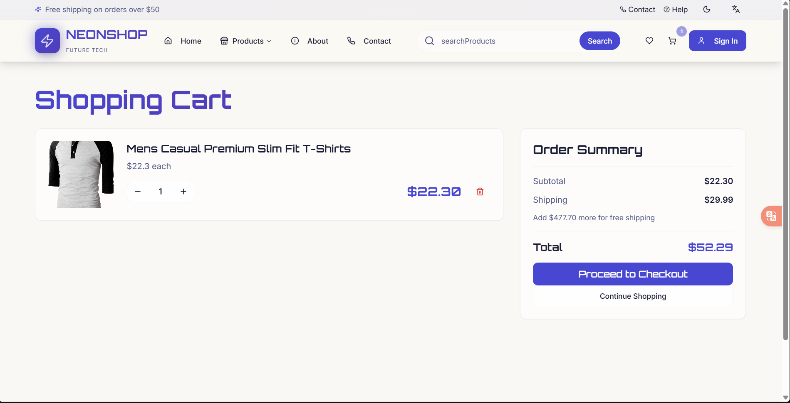
*Shopping cart with item list, product images, quantities, individual prices, and total calculations*

### 💳 Checkout Process

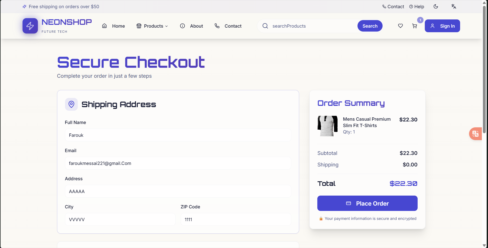
*First step of checkout: Address information form with validation*

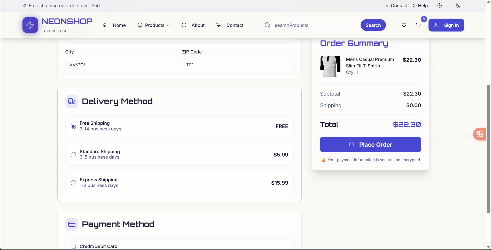
*Second step: Delivery method selection with different shipping options*

---

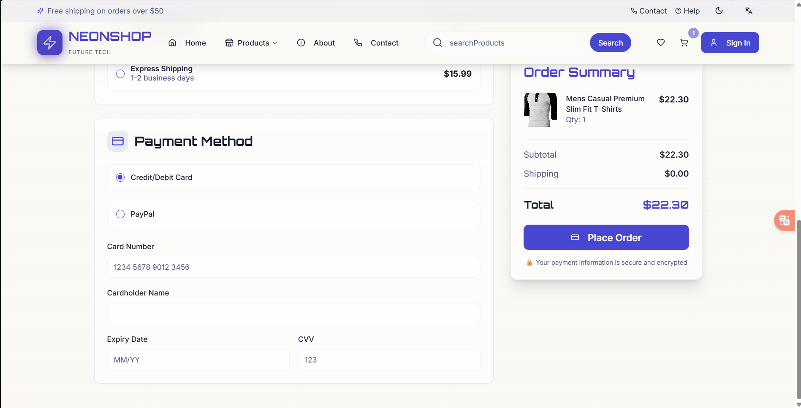
*Third step: Payment information form with card details and order summary*

---

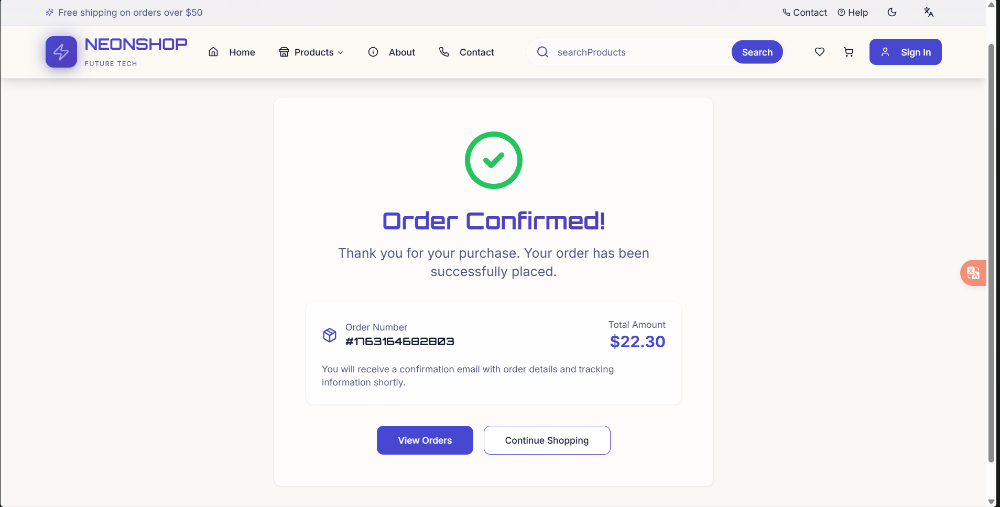
*Order confirmation page with order number, items, delivery details, and tracking information*

---

### 👤 User Authentication & Profile

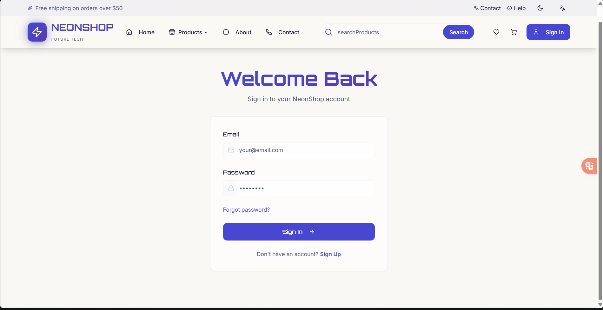
*Login form with email and password fields, validation, and link to signup*

---

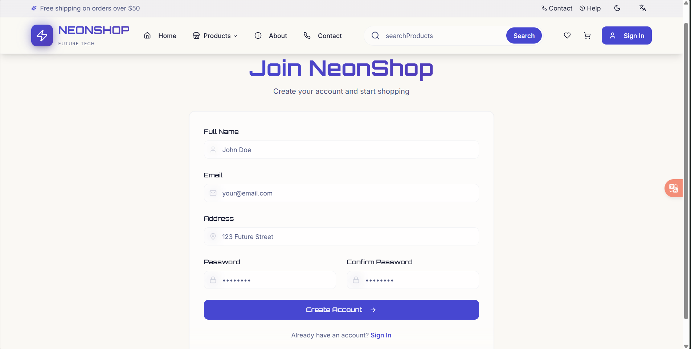
*Registration form with name, email, password fields, and validation messages*

---

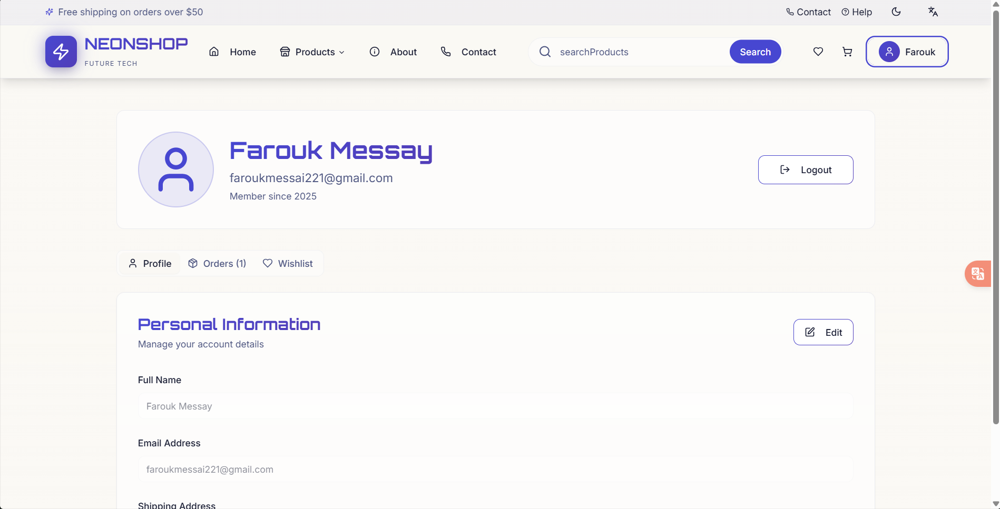
*User profile page showing personal information and edit functionality*

---

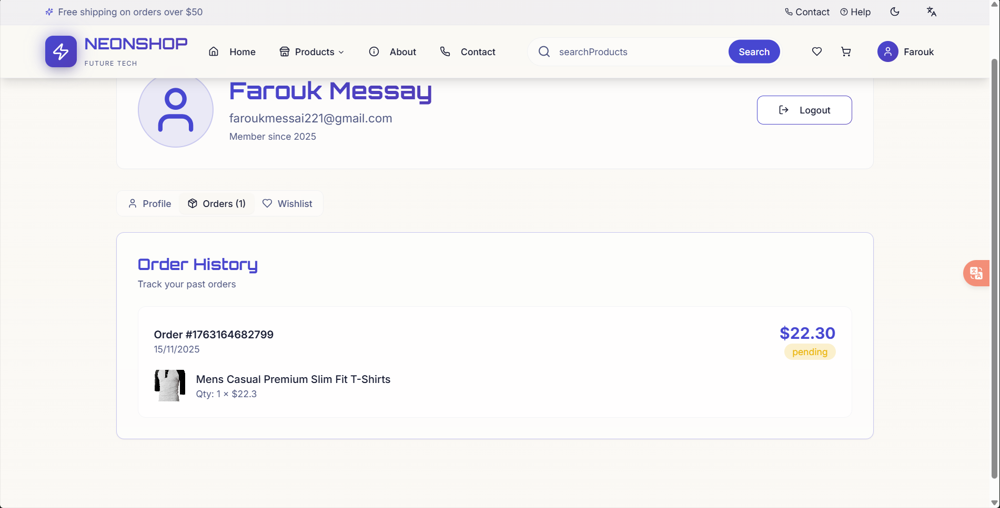
*Detailed view of a specific order with items, prices, and delivery status*

---

### ❤️ Wishlist

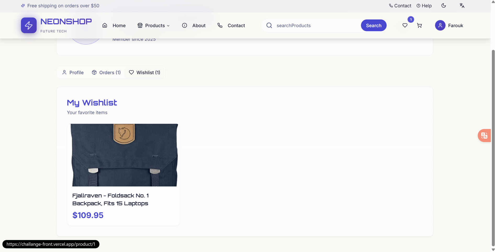
*Wishlist page showing all saved favorite products with options to add to cart or remove*

---

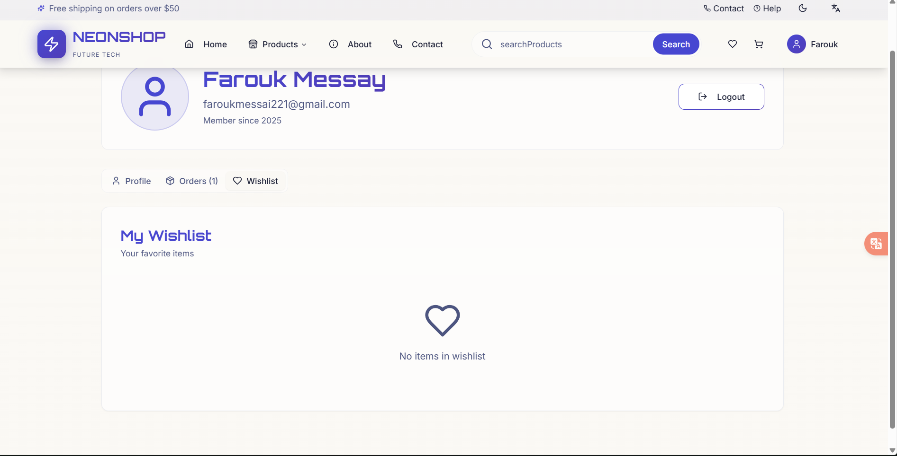
*Empty wishlist page with call-to-action to browse products*

---

## 📋 Table of Contents

- [Screenshots](#-screenshots)
- [Features](#features)
- [Technologies Used](#technologies-used)
- [Architecture](#architecture)
- [Local Storage Implementation](#local-storage-implementation)
- [API Integration](#api-integration)
- [State Management](#state-management)
- [Getting Started](#getting-started)
- [Project Structure](#project-structure)

## ✨ Features

### Core E-Commerce Features

- **Product Catalog**: Browse products with advanced filtering and sorting
- **Product Search**: Real-time search with debouncing
- **Category Navigation**: Filter products by categories (Electronics, Jewelry, Men's Clothing, Women's Clothing)
- **Product Details**: Detailed product pages with image galleries, reviews, and ratings
- **Shopping Cart**: Add/remove items, update quantities, view cart total
- **Wishlist**: Save favorite products for later
- **Checkout Process**: Multi-step checkout with address, delivery, and payment options
- **Order Confirmation**: Order summary and confirmation page
- **Pagination**: Navigate through products with page controls

### User Features

- **Authentication System**: Complete login/signup flow with form validation
- **User Profile**: Manage personal information and address
- **Order History**: View past orders with status tracking
- **Persistent Sessions**: Auto-login on return visits

### UI/UX Features

- **Responsive Design**: Fully responsive across mobile, tablet, and desktop
- **Dark/Light Mode**: Theme switcher with system preference detection
- **Multi-language Support**: i18n implementation for multiple languages
- **Hero Carousel**: Animated image carousel on homepage
- **Quick View**: Preview products without leaving the page
- **Toast Notifications**: Real-time feedback for user actions
- **Loading States**: Skeleton loaders and loading indicators
- **Professional Navbar**: Multi-level navigation with dropdown menus
- **404 Page**: Custom not found page with navigation
- **SEO Optimized**: Meta tags, semantic HTML, and proper heading structure

## 🛠️ Technologies Used

### Core Technologies

- **React 18.3.1**: UI library with hooks and functional components
- **TypeScript**: Type-safe development
- **Vite**: Fast build tool and dev server
- **React Router DOM 6.30.1**: Client-side routing

### State Management

- **Redux Toolkit 2.9.2**: State management with slices
- **React Redux 9.2.0**: React bindings for Redux
- **Redux Persist**: Automatic localStorage persistence

### UI Framework & Styling

- **Tailwind CSS**: Utility-first CSS framework
- **shadcn/ui**: High-quality component library
- **Framer Motion 12.23.24**: Animation library
- **Lucide React**: Icon library
- **next-themes**: Theme management

### Data Fetching

- **TanStack React Query 5.83.0**: Server state management
- **Axios 1.12.2**: HTTP client

### Form Management

- **React Hook Form 7.61.1**: Form state management
- **Zod 3.25.76**: Schema validation
- **@hookform/resolvers**: Integration between RHF and Zod

### 3D Graphics

- **Three.js 0.160.0**: 3D graphics library
- **@react-three/fiber**: React renderer for Three.js
- **@react-three/drei**: Useful helpers for R3F

## 🏗️ Architecture

### State Management Architecture

The application uses Redux Toolkit with four main slices:

1. **Products Slice** (`src/store/slices/productsSlice.ts`)
   - Manages product data, categories, filters, sorting
   - Handles pagination state
   - Uses React Query for data fetching

2. **Cart Slice** (`src/store/slices/cartSlice.ts`)
   - Manages shopping cart items and quantities
   - Calculates cart totals
   - Syncs with localStorage

3. **Wishlist Slice** (`src/store/slices/wishlistSlice.ts`)
   - Manages favorite products
   - Toggle add/remove functionality
   - Syncs with localStorage

4. **Auth Slice** (`src/store/slices/authSlice.ts`)
   - Manages user authentication state
   - Handles login/logout/register
   - Stores user profile and orders
   - Syncs with localStorage

### Component Architecture

- **Pages**: Route-level components (`src/pages/`)
- **Components**: Reusable UI components (`src/components/`)
- **UI Components**: shadcn/ui components (`src/components/ui/`)
- **Hooks**: Custom React hooks (`src/hooks/`)
- **Services**: API integration (`src/services/`)
- **Types**: TypeScript type definitions (`src/types/`)

## 💾 Local Storage Implementation

### What is Stored in Local Storage?

1. **Shopping Cart** (`localStorage.cart`)
   ```typescript
   interface CartItem {
     id: number;
     title: string;
     price: number;
     image: string;
     quantity: number;
   }
   ```

2. **Wishlist** (`localStorage.wishlist`)
   ```typescript
   interface WishlistItem {
     id: number;
     title: string;
     price: number;
     image: string;
     category: string;
   }
   ```

3. **User Authentication** (`localStorage.user`)
   ```typescript
   interface User {
     id: string;
     name: string;
     email: string;
     address: string;
   }
   ```

4. **Orders** (`localStorage.orders`)
   ```typescript
   interface Order {
     id: string;
     date: string;
     total: number;
     status: 'pending' | 'shipped' | 'delivered';
     items: CartItem[];
   }
   ```

### How Local Storage is Used

#### Cart Persistence
```typescript
// src/store/slices/cartSlice.ts
const loadCartFromStorage = (): CartItem[] => {
  const saved = localStorage.getItem('cart');
  return saved ? JSON.parse(saved) : [];
};

// Every cart action automatically syncs to localStorage
localStorage.setItem('cart', JSON.stringify(state.items));
```

#### Wishlist Persistence
```typescript
// src/store/slices/wishlistSlice.ts
const loadWishlistFromStorage = (): WishlistItem[] => {
  const saved = localStorage.getItem('wishlist');
  return saved ? JSON.parse(saved) : [];
};

// Synced on every add/remove action
localStorage.setItem('wishlist', JSON.stringify(state.items));
```

#### Authentication Persistence
```typescript
// src/store/slices/authSlice.ts
const loadAuthFromStorage = () => {
  const user = localStorage.getItem('user');
  const orders = localStorage.getItem('orders');
  return {
    user: user ? JSON.parse(user) : null,
    isAuthenticated: !!user,
    orders: orders ? JSON.parse(orders) : [],
  };
};
```

### Why Local Storage?

- **Persistence**: Data survives page refreshes and browser restarts
- **No Backend Required**: Demo app without server dependencies
- **Fast Access**: Immediate data retrieval
- **User Experience**: Seamless experience across sessions

## 🌐 API Integration

### FakeStore API

The application uses the [FakeStore API](https://fakestoreapi.com) for product data.

**Base URL**: `https://fakestoreapi.com`

### API Endpoints Used

1. **Get All Products**
   ```typescript
   GET /products
   // Returns: Array of all products
   ```

2. **Get Single Product**
   ```typescript
   GET /products/{id}
   // Returns: Single product object
   ```

3. **Get All Categories**
   ```typescript
   GET /products/categories
   // Returns: Array of category names
   ```

4. **Get Products by Category**
   ```typescript
   GET /products/category/{category}
   // Returns: Array of products in category
   ```

### API Service Implementation

```typescript
// src/services/api.ts
import axios from 'axios';

const api = axios.create({
  baseURL: 'https://fakestoreapi.com',
  timeout: 10000,
});

// Simulate realistic API delays
const delay = (ms: number) => new Promise(resolve => setTimeout(resolve, ms));

export const fetchProducts = async () => {
  await delay(800);
  const response = await api.get('/products');
  return response.data;
};
```

### Product Data Structure

```typescript
interface Product {
  id: number;
  title: string;
  price: number;
  description: string;
  category: string;
  image: string;
  rating: {
    rate: number;
    count: number;
  };
}
```

### Mock Data Generators

For features not provided by FakeStore API:

```typescript
// Generate mock product reviews
export const generateMockReviews = (productId: number) => {
  return [
    { id: 1, user: 'John Doe', rating: 5, comment: 'Excellent!', date: '2025-01-15' },
    // ... more reviews
  ];
};

// Generate additional product images
export const generateMockImages = (mainImage: string) => {
  return [mainImage, mainImage, mainImage];
};
```

## 🔄 State Management

### Redux Store Configuration

```typescript
// src/store/store.ts
import { configureStore } from '@reduxjs/toolkit';

export const store = configureStore({
  reducer: {
    products: productsReducer,
    cart: cartReducer,
    wishlist: wishlistReducer,
    auth: authReducer,
  },
});
```

### Key Redux Actions

**Cart Actions:**
- `addToCart(product, quantity)`: Add item to cart
- `removeFromCart(productId)`: Remove item from cart
- `updateQuantity(productId, quantity)`: Update item quantity
- `clearCart()`: Empty the cart

**Wishlist Actions:**
- `addToWishlist(product)`: Add to wishlist
- `removeFromWishlist(productId)`: Remove from wishlist
- `toggleWishlist(product)`: Toggle wishlist status

**Auth Actions:**
- `register(userData)`: Create new account
- `login(email, password)`: Authenticate user
- `logout()`: End session
- `updateProfile(userData)`: Update user info
- `addOrder(orderData)`: Add new order

## 🚀 Getting Started

### Prerequisites

- Node.js (v16 or higher)
- npm or yarn

### Installation

1. **Clone the repository**
   ```bash
   git clone <YOUR_GIT_URL>
   cd <YOUR_PROJECT_NAME>
   ```

2. **Install dependencies**
   ```bash
   npm install
   ```

3. **Start development server**
   ```bash
   npm run dev
   ```

4. **Build for production**
   ```bash
   npm run build
   ```

5. **Preview production build**
   ```bash
   npm run preview
   ```

### Development with Vercel

Simply visit https://challange-front.vercel.app

## 📁 Project Structure

```
src/
├── assets/              # Static assets (images, fonts)
│   ├── hero-1.jpg
│   ├── hero-2.jpg
│   └── hero-3.jpg
├── components/          # Reusable components
│   ├── ui/             # shadcn/ui components
│   ├── Categories.tsx
│   ├── FeaturedProducts.tsx
│   ├── Header.tsx
│   ├── HeroCarousel.tsx
│   ├── LanguageSelector.tsx
│   ├── ProductCard.tsx
│   ├── ProductFilters.tsx
│   ├── QuickView.tsx
│   ├── Scene3D.tsx
│   └── ThemeToggle.tsx
├── contexts/           # React contexts
│   └── LanguageContext.tsx
├── hooks/              # Custom React hooks
│   ├── use-mobile.tsx
│   └── use-toast.ts
├── pages/              # Route components
│   ├── About.tsx
│   ├── Cart.tsx
│   ├── Checkout.tsx
│   ├── Contact.tsx
│   ├── FAQ.tsx
│   ├── Index.tsx
│   ├── Login.tsx
│   ├── NotFound.tsx
│   ├── OrderConfirmation.tsx
│   ├── ProductDetail.tsx
│   ├── Products.tsx
│   ├── Profile.tsx
│   └── Signup.tsx
├── services/           # API services
│   └── api.ts
├── store/              # Redux store
│   ├── slices/
│   │   ├── authSlice.ts
│   │   ├── cartSlice.ts
│   │   ├── productsSlice.ts
│   │   └── wishlistSlice.ts
│   ├── hooks.ts
│   └── store.ts
├── types/              # TypeScript types
│   └── index.ts
├── App.tsx             # Root component
├── index.css           # Global styles
├── main.tsx            # Entry point
└── vite-env.d.ts       # Vite types
```

## 🎨 Design System

### Color Tokens (HSL)

The application uses a semantic color system defined in `src/index.css`:

- **Primary Colors**: Brand identity
- **Secondary Colors**: Supporting elements
- **Accent Colors**: Call-to-action elements
- **Muted Colors**: Backgrounds and subtle elements
- **Destructive Colors**: Error states

### Responsive Breakpoints

```css
sm: 640px   /* Mobile landscape */
md: 768px   /* Tablet */
lg: 1024px  /* Desktop */
xl: 1280px  /* Large desktop */
2xl: 1536px /* Extra large */
```

## 📱 Responsive Design

All components are fully responsive with mobile-first approach:

- **Mobile**: Single column layouts, hamburger menu
- **Tablet**: 2-column grids, collapsible sidebar
- **Desktop**: Multi-column grids, full navigation

## 🔐 Security Considerations

- **Input Validation**: Zod schemas for all forms
- **XSS Prevention**: React's built-in escaping
- **Password Storage**: Client-side only (demo purposes)
- **HTTPS**: Recommended for production deployment

## 🚢 Deployment

### Deploy to Vercel (Recommended)

This project is optimized for Vercel deployment with proper routing and caching configurations.

#### Quick Deploy Steps

1. **Push to GitHub** (if not already done):
   ```bash
   git init
   git add .
   git commit -m "Initial commit"
   git remote add origin your-repo-url
   git push -u origin main
   ```

2. **Deploy on Vercel**:
   - Go to [vercel.com](https://vercel.com)
   - Sign in with your GitHub account
   - Click "New Project"
   - Import your GitHub repository
   - Vercel will auto-detect Vite configuration
   - Click "Deploy"

#### Manual Configuration (if needed)

If Vercel doesn't auto-detect settings, configure:
- **Framework Preset**: Vite
- **Build Command**: `npm run build`
- **Output Directory**: `dist`
- **Install Command**: `npm install`


### Other Hosting Services

The project can also be deployed to:

- **Netlify**:
   - Build command: `npm run build`
   - Publish directory: `dist`
   - Add `_redirects` file for SPA routing

- **GitHub Pages**:
   - Requires additional base path configuration in vite.config.ts
   - Use GitHub Actions for automated deployment

- **Cloudflare Pages**:
   - Build command: `npm run build`
   - Build output directory: `dist`
   - Framework preset: Vite

### Configuration Files

The project includes `vercel.json` for:
- Client-side routing support (SPA fallback)
- Security headers (X-Content-Type-Options, X-Frame-Options, X-XSS-Protection)
- Asset caching optimization


## 🙏 Acknowledgments

- **FakeStore API**: Product data
- **shadcn/ui**: Component library
- **Vercel**: Development platform
- **Tailwind CSS**: Styling framework
